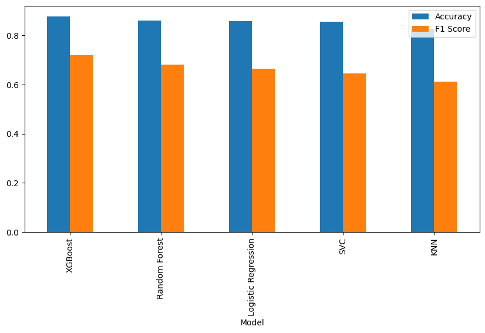

# Adult Income Classification

This project aims to predict whether an individual earns more than $50K/year based on demographic and employment-related attributes using the **Adult Income dataset**. The dataset has been analyzed using multiple machine learning models, including **Logistic Regression**, **Support Vector Classifier (SVC)**, **K-Nearest Neighbors (KNN)**, **Random Forest**, and **XGBoost**. The models are evaluated based on **Accuracy** and **F1 Score**.

## Dataset Overview

The **Adult Income dataset** contains census data used for predicting whether an individual earns more than $50K/year. The dataset includes demographic and employment-related features such as:

- **age**: Age of the individual
- **workclass**: Type of employment (e.g., Private, Self-emp, etc.)
- **fnlwgt**: Final weight (representing the number of people that the census data represents)
- **education**: Highest level of education (e.g., Bachelors, Masters, etc.)
- **education_num**: Number of years of education
- **marital_status**: Marital status (e.g., Married, Divorced, etc.)
- **occupation**: Type of occupation (e.g., Tech-support, Prof-specialty, etc.)
- **relationship**: Relationship status (e.g., Husband, Wife, etc.)
- **race**: Race of the individual (e.g., White, Black, etc.)
- **sex**: Gender (Male or Female)
- **capital_gain**: Capital gain from investments
- **capital_loss**: Capital loss from investments
- **hours_per_week**: Hours worked per week
- **native_country**: Country of origin
- **income**: Target variable (whether an individual earns >$50K/year: `>50K` or `<=50K`).

## Data Preprocessing

### 1. **Handling Categorical Variables with `get_dummies`**

To convert categorical features into a numerical format, I used **Pandas `get_dummies()`** method to perform one-hot encoding on the categorical variables. This method creates a binary column for each category in the original feature, allowing machine learning models to process categorical variables effectively.

### 2. **Scaling Features**

Although the dataset does not have significant differences in the range of numerical features, applying scaling techniques like **StandardScaler** could help models such as KNN and Logistic Regression, where the performance might be sensitive to the scale of features. 

## Model Evaluation

### 1. **Accuracy**

It gives a general indication of the model's performance.

### 2. **F1 Score**

Since the dataset might have an unequal distribution of the target variable (`>50K` and `<=50K`), **F1 Score** provides a better performance measure than accuracy alone.

### 3. **Comparison of Models**

After training the models, I evaluated them based on the **Accuracy** and **F1 Score** metrics. The following bar chart shows a comparison of these two metrics for each model:

